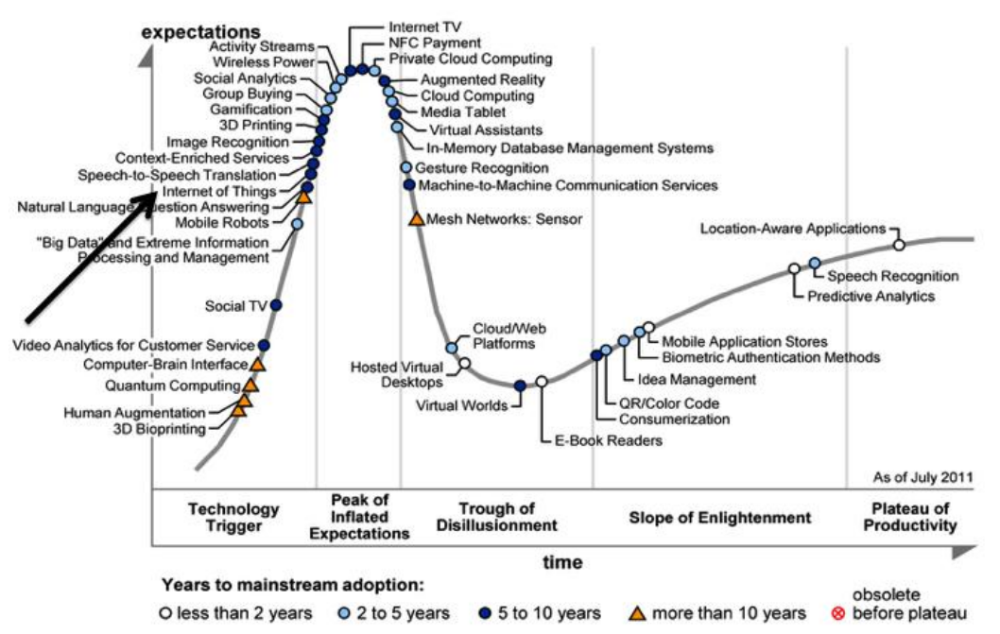

# Introduction

The current state of academia and enterprise is sharply split on the implementation of recent advancements in networking technology and harvesting the benefits therein. Many researchers are producing promising results by creating highly efficient systems for organizing, processing, and reporting data through the use of **wireless sensor networks** (WSNs). Unfortunately, the adoption of these technologies in enterprise have been slow. In recent years, however, topics such as WSNs and the **internet of things** (IoT) have become increasingly prevalent in popular media. Figure 1 shows the frequency of keywords related to this phenomena searched in Google since 2004 [@iot-overview]. Each of these ideas are closely related to **ubiquitous computing** (ubicomp), an idea popularized by Mark Weiser, which asserts that computing will be highly available everywhere, from your appliances to sensors and more. In this paper, we will introduce the foundation concepts behind wireless sensor networks and the internet of things by examining [@iot-overview]. Next, we will narrow down our discussion to a particularly interesting paradigm called **smart objects** [@iot-sense]. Lastly, we will examine an actual implementation, called "Auto ID" in [@wongintelligent] and discuss the benefits gained through implementing such a system in an enterprise environment.

![Google Trends for IoT, WSNs, and ubicomp. [@iot-overview]](img/trends.png "Google Search Term Popularity: IoT, WSN, ubicomp")

# Internet of Things (IoT): A Vision, Architectural Elements, and Future Directions

Before we begin our discussion on the state of context-aware smart objects, we should define foundational ideas in the IoT paradigm concretely. For this task, we turn to [@iot-overview], where the authors accurately describe the current state of the IoT, WSNs, and their position in the business landscape. For the purposes of this paper, the definition IoT is closely tied to ubicomp, which is the idea that computing is present everywhere in an environment. When framed this way, we can define the IoT is a computing network where background processing and sensing work in the background, *hidden* from the user. The authors suggest that the success of the IoT is proportional to the success of another facet of ubicomp, which is **cloud computing**. A precise definition of cloud computing is not within the scope of this paper and is left as an exercise to the reader. However, it is worth noting that the rise of inexpensive, on-demand server machines has greatly increased the viability of the IoT landscape.

There are three distinct paradigms within the IoT that are discussed in the paper: (1) the internet oriented paradigm (middleware), (2) the things oriented paradigm (sensors), (3) and the semantic oriented paradigm (knowledge). The authors state that "the usefulness of IoT can be unleashed only in an application domain where the three paradigms intersect". They discuss many precise definitions of the IoT, but ultimately come to the conclusion that the IoT is the "interconnection of sensing and actuating devices providing the ability to share information across platforms through an unified framework, developing a common operating picture for enabling innovative applications. This is achieved by seamless large scale sensing, data analytics and information representation using cutting edge ubiquitous sensing and cloud computing".

Next, the authors discuss the current trends in the IoT. Figure 2 shows the hype cycle around the internet of things, which represents the forecasted lifecycle of an idea over the next decade. The authors assert that the IoT will not be adopted by the market until about 5-10 years down the road, which explains the slow adoption of these ideas by corporations.

The authors discuss many other topics concerning the IoT, such as visualization techniques, data storage, and a comparison of various cloud computing services. Although most of these sections do not directly relate to the topic of this paper, there are two sections in particular that are valuable to our discussion: (1) the RFID/WSN discussion and (2) the application of IoT to enterprise.

This paper asserts that many of the IoT networks will be implemented through a WSN and radio frequency identification (RFID) technology. Devices equipped with RFID identify themselves by exposing an electronic chip with unique information describing the device stored on them. These chips act as a sort of passive barcode, meaning they are not directly powered by a battery. Rather, these tags harvest the energy of the scanner's signal to communicate it's ID back to the scanner. This design is particularly effective in enterprise situations, such as supply chain management, as objects in the supply chain do not need to be powered by a battery. This model of power consumption fits well with a WSN, which uses low cost, low power miniature devices to accomplish remote sensing networks.

Second, the article discusses the application of a network of things within a work environment as an "enterprise based application". The paper suggests several specific applications, such as security, automation, and climate control. One important definition that is introduced is the "Smart Environment IoT", which concerns different environments such as factory floors or transportation systems automatically adjusting based on the current state of the environment. Figure 3 shows some of the sample applications suggested in the paper. With these foundational ideas defined, we can begin a discussion of the intricacies of implementing a smart environment.

![Some suggested applications of IoT to enterprise [@iot-overview]](img/enterprise-applications.png "Enterprise Applications")

# Adding sense to the Internet of Things - An architecture framework for Smart Object systems.

Next, we examine [@iot-sense] where the authors provide a framework for realizing the previously mention smart environment, called smart objects. They begin by introducing a trivial approach to monitoring object states and then debunking that simple case. In this trivial approach, sensors are placed on the outer edges of some environment and detect when objects enter into that environment. They discuss several problems with this approach, such as inaccurate sensor data and proximity constraints. The authors suggest that as the amount of data we want to store about objects in an environment increases, we move away from this beacon-centric model and "we witness an evolution toward object-centric systems, where manufactured items take control over the flow of information which was traditionally retrieved manually by human operators." The paper then goes on to define these smart objects as having 5 unique qualities. In particular, they

-   possess a unique identity.
-   are able to sense and store measurements made by sensor transducers associated with them.
-   are able to make their identification, sensor measurements, and other attributes available to external entities such as other objects or systems.
-   can communicate with other smart objects.
-   can make decisions about themselves and their interactions with external entities.

![Smart objects architecture presented in [@iot-sense]](img/smart-object-architecture.png "Smart Objects Architecture")

Figure 4 shows the proposed architecture for the smart objects paradigm. Concretely, consider a shipping container in a warehouse within which we need to monitor vital temperature information. This container would be outfitted with a low power, wireless sensor network node with sensors that can collect the temperature inside. Because this sensor is a member of a wireless sensor network, the information reported by its sensor can easily be queried across the network. Furthermore, if physical analysis is needed, the container can be identified by scanning the node's RFID information to uniquely identify it. This example clearly illustrates the fulfillment of the 5 points set forth by the authors of this paper.

Next, the authors suggest the idea that having each node communicate with the receiver is good for simple systems, but not for large systems with a plethora of nodes. We can overcome this problem by having the nodes utilize ad-hoc networking to form small clusters. Each cluster elects a **cluster head**, which collects sensor information from all of the nodes within its cluster and communicates this information to the receiver as a proxy. Generally speaking, since being the cluster head consumes more energy, cluster heads should be rotated, so that no one node's battery is drained too much. Other considerations for choosing a cluster head include network strength, special abilities of the node, and processing power. Benefits of this approach are numerous, including *redundancy* (through double clustering), *energy conservation*, *no global information store* (saves memory), *no need for synchronization*, *mobility support*, and *low algorithmic complexity*.

However, the smart objects in and of themselves are not enough to achieve the maximum benefit that these devices are capable of delivering - you need a cohesive interface with which users can interact and understand the information. You need to implement some *information infrastructure* within which the nodes should communicate. In this paper, the authors suggest an event-driven infrastructure for the nodes to communicate. Two types of events are recognized within their system:

-   Events corresponding to network changes, such as a node entering or leaving a cluster.
-   Events corresponding to a node reporting its sensor values.

The authors give a name to the virtual representation of the network that can be presented to the end-user: *Smart Object network structure repository* (SONSR). This information is stored in the *gateway*, which is the location which receives all of the data sent from the WSN, decodes this information into something sensible, and present it to the end user. Two interfaces are exposed to the end-user to query the previously mentioned, event-driven data: (1) **query interface** to query data about the SONSR and (2) **capture interface** to query data concerning the sensor data reported by the nodes.

This paper cites three main roadblocks to the widespread adoption of the smart object paradigm: (1) economic challenges, (2) privacy concerns, and (3) scalability challenges. Only recently did the price of RFID sensors drop to a reasonable price to be used at a large scale. However, if these RFID sensors travel with packages and are simply thrown away after delivery with the shipping container, the cost to embed RFID chips continues to be prohibitive. Therefore, any company looking to use this is a production system should reuse the RFID sensors and amortize the cost over the life of the sensor. 

Next, because packages are each tracked using a unique identifier that constantly reports information about itself (such as temperature, location, etc.), packages are no longer uniform and anonymous. Rather, anyone with access to the capture interface and the query interface could potentially determine enough data about a package to reveal it's contents. 

Lastly, the storage capacity needed to store historical data from the WSN increases linearly with the amount of nodes you place in the system. The authors suggest that for larger systems, historical data be passed through another layer that parses out important features and forgets the rest (essentially, dimensionality reduction).

This work was not meant to be a practical study involving heavy experimentation and analysis. Rather, the authors aim to introduce the idea of the smart object paradigm into the literature and suggest some preliminary theoretical optimizations. However, this work could easily be built on by implementing some of the practical systems in a large scale test bed (like an industrial warehouse) and monitor concrete data.

# The Intelligent Product Driven Supply Chain

Up until this point, we have defined theoretically:

-   An overview of wireless sensor networks and the internet of things
-   The benefits of deploying such a system in the enterprise
-   An especially efficient paradigm for organizing information in the enterprise using WSNs.

Although we have gained a bird's eye view of how these technologies can be applied to improve enterprise performance, we lack a specific implementation that can put these ideas into practice. Therefore, we will now examine [@wongintelligent], which describes an **intelligent product** supply chain (here, the authors use "intelligent product" in place of "smart object").

First, the authors begin by making a distinction between a *simple* product and a *complex* product. For their purposes, a **simple product** is defined as "one that has only a few constituent parts, with relatively straightforward processes for production, packaging and logistics, and with simple information and material flows". On the other hand, a **complex product** has "many constituent parts, each part manufactured to high precision backed up by a level of research and development", such as a computer server or a sports car, etc. In complex products, material flow is complicated by product returns, part malfunctions, etc.

With regards to the intelligence that a product posses, two types of intelligence are proposed. The first is **Level 1 product intelligence**, which allows a product to communicate information about it's status, such as location, features, etc., back to the network. In other words, Level 1 intelligence is *information oriented*. The second type of product intelligence is **Level 2 product intelligence**. This type of intelligence is *decision oriented*, giving products the ability to influence it's own actions (such as self-organizing inventory). Obviously, Level 2 product intelligence is the more interesting idea. Figure 5 shows a simple intelligent spaghetti can with Level 1 product intelligence.

![Simple intelligent spaghetti can with Level 1 product intelligence [@wongintelligent]](img/smart-spaghetti.png "Smart Spaghetti Can")

The main focus of this paper is the author's examination of how their "Auto ID" system can "enhance information collection and decision making systems across the supply chains of simple and complex products".

For Level 1 products, the authors suggest the following benefits:

-   Proof-of-delivery
-   Process costing across all stages of production
-   High-resolution product recall
-   Real-time identification of bottlenecks and congestions.
-   Enable *product-based accounting*, where the cost of the product varies based on the production and distribution rates (thereby, maximizing profits).

These benefits are achieved through access to three main features about the product enabled by the intelligence system: (1) product status, (2) product tracking, and (3) product history access.

For Level 2 product intelligence, the processes are much more complicated, but the benefits are also more numerous. In this level of intelligence, we can "exploit the availability of real-time data to provide the opportunity to enable new processes and also control convention supply chain processes in a much more effective way". The authors list the following benefits for this level of intelligent product:

-   Control supply chain processes more effectively
-   Products individually tailored to specifications
-   Late changes to orders more easily handled
-   Customers could "bid" for the same product in the supply chain
-   Inventory could be self-organizing
-   Real-time planning based on congestion information
-   Products can self-route through the production line
-   Systems could be much more automated and alert a human only if a problem arises

The paper suggests many benefits that arise in both Level 1 and Level 2 systems when applied to lifecycle applications. Although we cannot address all of them in this paper, a few of the more prevalent benefits are listed here.

*Level 1, simple intelligent products*

-   Advice about health warnings tailored to product and to individual
-   Accurate product recall information
-   High security by predicting theft
-   Eliminate need to periodically stock shelves, allowing for efficient human hours
-   Open the possibility for just-in-time production

*Level 1, complex intelligent products*

-   Proof-of-purchase travels with product for warranty tracking
-   All data on product lifecycle stored for better maintenance and customer service
-   Anti-theft measure lower insurance premiums
-   Quality checking improved, customer confidence grows

*Level 2, simple intelligent products*

-   Automatic reordering of products based on delivery date
-   Automatic shelf-replinishing
-   Automatic inventory system
-   Mixed palleting is easier

*Level 2, complex intelligent products*

-   Customer can trigger made-to-order production
-   Efficiency can remain high by balancing production and demand
-   Self-organizing distribution schedules
-   Disposal or refurbishment costs can be automatically calculated

The authors then discuss the benefits of an enterprise's ability to redesign its supply chain based on information gained from intelligent products. In the author's "Auto ID" implementation, information about a product is stored in a database (after being parsed by the gateway) in Physical Mark-up language (PML). Figure 6 shows how retaining all of this information on intelligent products would affect an enterprise's business model.

![Fully Integrated Supply Chain [@wongintelligent]](img/business-model.png "Fully Integrated Supply Chain")

The most prevalent benefit discussed by the authors is a shift from selling a product to selling a service, similar to a drop-ship model. Products are produced on demand and contracts to maintain the products are easily fulfilled by the high availability of information about the product's lifecycle and health. This subscription model approach has huge implications on the profit margins a company can maintain. Furthermore, the granularity of what a company offers in this subscription model is much more flexible, allowing more customers to be reach.

Next, the authors suggest that moving from a product-oriented enterprise to a service-oriented enterprise positively affects how customers view the company. Companies have more flexibility, becoming more dynamic and resourceful. Theoretically speaking, since information about products are continuously reporting back information about themselves, they could "teach" each other to become more effective at whatever they were designed to do.

Lastly, the authors suggest that through the advent of their "Auto ID" technology, a standardized interface might emerge that could revolutionize this industry. This would allow corporations to compound off of each other's advances rather than compete against one another.

The authors don't discuss many of the shortcomings of this model, except that it is susceptible to system shocks and disturbances due to connectivity and processing shortcomings. The authors could definitely improve on this research in two main ways: (1) they should focus less on promoting their "Auto ID" technology through the paper and focus more on investing in physical experimentation to back up their claims. (2) The authors should expound on failures that could arise in their system, such as node alienation, technology malfunction, and database malfunctions, and how to prevent these failures.

# Conclusion

In this paper, we first defined the theoretical concepts behind wireless sensor networks and the internet of things [@iot-overview]. These definitions were sufficient to construct the smart object paradigm, within which wireless sensor networks are attached to objects to allow these objects to gain some level of intelligence and ultimately improve efficiency in manufacturing systems [@iot-sense]. Lastly, we examined a specific implementation of these smart objects called "Auto ID". According to the Hype graph (Figure 2), the adoption of smart objects into the enterprise is slow, but on track for implementation in the next 5-7 years. In each of these papers, we believe that each paper shares the same major shortcoming - lack of practical results. For the first paper [@iot-overview], this assessment may be unfair, as the authors specifically state that their paper is simply an overview. However, the other two papers lack sufficient concrete evidence to back up a select few of their conclusions. This shortcoming might be because the availability of test-beds for large scale WSN are sparse to say the least. However, as the literature moves from theoretical ideas to more practical experimentation, we conclude that the smart object paradigm will become a highly valuable application of WSNs to the enterprise that will benefit the company and the consumer alike.
