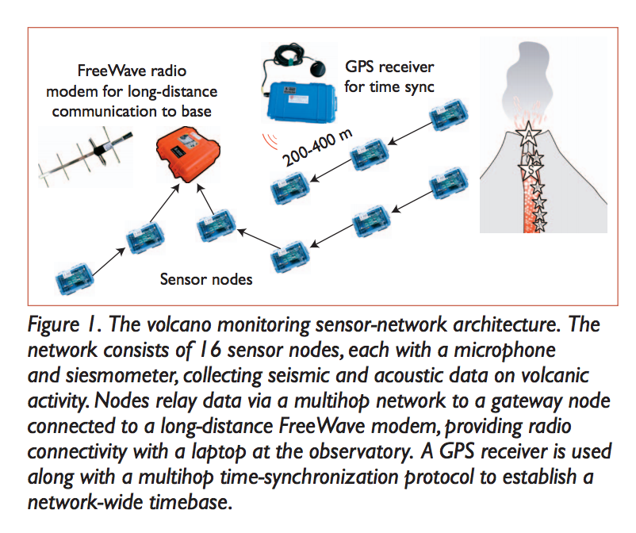
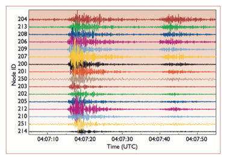

% Deploying a WSN on an Active Volcano
% Clay McLeod
% September 29, 2015

## References

### Paper
> [Werner-Allen, G., Lorincz, K., Ruiz, M., Marcillo, O., Johnson, J., Lees, J., & Welsh, M. (2006). Deploying a wireless sensor network on an active volcano. Internet Computing, IEEE, 10(2), 18-25.](http://www.eecs.harvard.edu/~mdw/papers/volcano-ieeeic06.pdf)

\vspace{12 mm}

> Viewable at [http://bit.ly/wsn-volcano](http://bit.ly/wsn-volcano)

## Overview

1. Discuss objectives of paper
2. Why is a WSN suitable for this task?
3. Potential roadblocks
4. Solutions implemented
5. Results

# Objectives

## Objectives

1. Deploy 16 low-power wireless sensor nodes on an active volcano.
2. Monitor seismic activity through accelerometer data.
3. Discuss the feasibility of this approach in this harsh environment.
4. Examine benefits and detriments.

# Why a WSN?

## Why a WSN?

### Why install into Volcano? ###

> * Monitor seismic activity to predict earthquakes.
> * Volcanic tomography (using signal processing to map the volcano's edifice).
> * Resolve debates over the physical processes at work within a volcano’s interior.

. . .

### Benefits of WSN ###

> * \large{Lightweight}
> * \large{Consume less power}
> * \large{Eliminate need for large local storage}
> * \large{Fast deployment}

# Potential roadblocks

## Potential roadblocks

> * Nodes must provide accurate data
    + Even a single corrupted sample can invalidate an entire dataset
    + Data is limited, therefore, it is valuable
> * Discrete signal analysis
    + High availability necessary when recording data
    + Time synchronization crucial for accurate results
> * Low radio bandwidth
    + Limits the amount of signal we can send
    + Not suited to long term analysis, authors focus on event driven data
> * Network Topology
    + Nodes must have large internode distance to capture diverse data
    + Node failure poses serious threat to communication

# Hardware

## Hardware

Each sensor was equipped with the following:

* 8-dBi 2.4 GHz external omnidirectional antenna
    + 2.4-GHz Chipcon CC2420 IEEE 802.15.4 radio
* Geospace Industrial GS-11 single axis seismometer
* Microphone
* Custom hardware interface board
* Runs TinyOS

# Overcoming High Data Rates

## Problem

### \underline{Explanation} ###

> IEEE 802.15.4 radios, such as the Chipcon CC2420, have raw data rates of
 **30 Kbytes per second**. However, overheads caused by packet framing, medium access control (MAC), and multihop routing reduce the achievable data rate to less than **10 Kbytes per second**, even in a single-hop network.

. . .

### \underline{Problem} ###
* Nodes can acquire data faster than they can transmit it.
* Long-term local storage infeasible, as flash memory (1 Mbyte) fills up in roughly 20 minutes during normal use cases.

## Solution

**Event Driven I/O** instead of stream based.

> 1. Each node runs an "event detection" program that uses a short-term average/long-term average threshold detector.
> 2. Upon triggering, the nodes sends a small message to the base-station laptop.
> 3. If enough nodes contact base station, laptop initiates round robin data collection from nodes.
    + Note that since most volcanic events last only 60 seconds, we should be able to keep this data stored long enough to retrieve.

# Reliable Data Transmission

## Problem

### \underline{Problem} ###

> Radio links are lossy and frequently asymmetrical.

## Solution

The authors developed a reliable data-collection protocol, which they called **Fetch**.

. . .

### \underline{Protocol} ###

> 1. The sensor node breaks it's data down into 256 bytes, then tags these blocks with timestamps and sequence numbers.
> 2. The laptop then sends packets out to the target node ID identifying which sequence numbers it is missing from that node.
> 3. In turn, the node will send the missing chunks until the laptop indicates it has received all sequences.
> 4. Because the network is sparse, the laptop uses **flooding** to request data from the network.

# Time Synchronization

## Problem

### \underline{Problem} ###

> The low-cost crystal oscillators on these nodes have low tolerances. Therefore, the clock rate varies across the network.

## Solution

The team implemented the **Flooding Time Synchronization Protocol (FTSP)**.

. . .

### \underline{Protocol} ###

> 1. One node was outfitted with a Garmin GPS receiver.
> 2. Using this receiver, the node would map FTSP global time to GMT.
> 3. This data was then flooded across the network and each node would update its time when its time was off by more than 10 milliseconds.

# Network Topology

## Network Topology

> * Roughly linear configuration that radiated away from the volcano's vent.
> * Aperture of roughly 3 kilometers. This was large enough to get a good understanding of seismic activity and small enough to allow for reliable communication.
> * Most nodes had 3 hops to base station. A select few were using 6.

## Figure 1

# Results

## Results

* General good performance
* 19 day deployment
* Network uptime: 61%
* Most common point of failure was software failure.
* Detected 230 events and 107 Mbytes of data.

## Future Work

* Optimize data collection path
* Deploy WSN with more than 100 nodes
* Deployment time > a few days
* Compute partial tomology images in WSN

# Questions?
